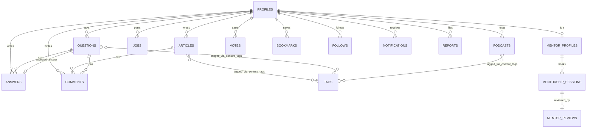
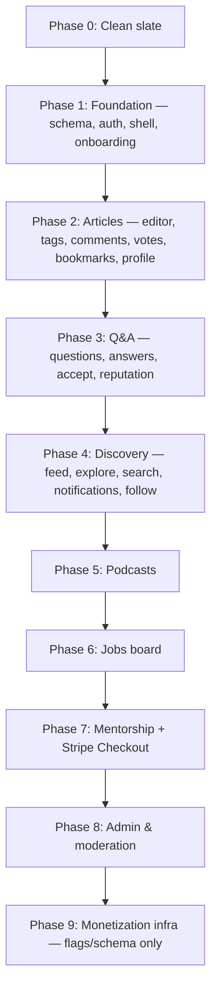

# FutureTech — Rebuild Plan

Status: **planning only, nothing deleted or written yet.** This document is the single plan to review/edit before Phase 0 (deletion) executes.

Source of truth for scope: `projectspec.md` (spec attached by user, byte-identical to the existing file). Grounded in the full codebase audit performed before this plan — every architectural decision below exists to close a specific defect found in that audit, called out inline as **(fixes: ...)**.

---

## 1. Guiding rules for this rebuild

1. **No nav item without a real page behind it.** The old build's biggest trust failure was placeholder pages linked from navigation (`/bookmarks`, `/jobs`, `/mentors`, `/explore`, `/admin`). A route is only added to nav in the same phase its page becomes real.
2. **The database owns invariants, not the app.** Counters, karma, notifications are triggers. App code never does read-then-increment.
3. **One typed client, one schema file.** Both Supabase clients are parameterized with `<Database>` from commit one. No table is queried before it exists in `database.ts`.
4. **One implementation per cross-cutting UI pattern.** One dialog, one dropdown, one tabs primitive, one vote-toggle action — reused everywhere, not re-implemented per page.
5. **One design doc, and it's the code.** `globals.css` tokens are the design system. No separate speculative Markdown spec that the CSS is allowed to drift from.
6. **Build the component, not the page.** Nothing gets hand-rolled inline a second time. If a pattern (card, row, stat chip, empty state, tab bar, overlay) is going to appear more than once, it's a component in `components/ui/` or the relevant domain folder *before* the second usage, not refactored into one after the fact. See §5.4 for the concrete discipline this implies.

---

## 2. Phase 0 — Clean slate

### Delete

| Path | Why |
|---|---|
| `src/` | full rebuild |
| `design/` | empty/unused (`design.md` was blank) |
| `design-system/` | documented a design system (`MASTER.md`) that the shipped CSS never matched; superseded by rule #5 |
| `guidelines/` | template file, never filled in |
| `Prototype for FutureTech/` | Figma Make scaffold, superseded |
| `phase9_plan.md` | superseded by this document |
| `refactor.js` | one-off regex codemod committed to the repo by mistake; if a global style change is needed again, do it as a reviewed diff, not a script |
| `default_shadcn_theme.css` | unused |
| `projectspec.md` | replaced by identical content, re-added below for clarity |

### Keep untouched

`package.json` (edited, not deleted — see §4), `tsconfig.json`, `next.config.ts`, `eslint.config.mjs`, `postcss.config.mjs`, `pnpm-workspace.yaml`, `.gitignore`, `AGENTS.md`, `ATTRIBUTIONS.md`, `.agents/`, `.kombai/`, `public/` (assets audited individually, not bulk-deleted), `node_modules/`, `.next/`.

### Re-add

- `projectspec.md` — unchanged, kept as the canonical spec reference.
- This file (`REBUILD_PLAN.md`) stays in the repo root as the build log/reference until the rebuild is complete, then gets moved to `/docs`.

---

## 3. Tech stack decisions

| Layer | Choice | Reasoning |
|---|---|---|
| Framework | Next.js 16, App Router, Server Actions | unchanged — was the right choice, execution was the problem |
| DB/Auth/Storage/Realtime | Supabase (Postgres) | unchanged, but schema rebuilt properly (§5) and clients typed (§6) |
| Styling | Tailwind v4 | unchanged |
| Forms | react-hook-form + zod | unchanged, but validation schemas shared instead of duplicated (§6) |
| Rich text | Tiptap (`@tiptap/react`, `starter-kit`, `extension-image`, `extension-placeholder`) | kept — was a sound choice, it was simply never wired into the live page |
| Content storage | Sanitized HTML from Tiptap (`editor.getHTML()`) | simpler and more robust than round-tripping to Markdown; still satisfies "Markdown-compatible" via Tiptap's built-in input rules (`# `, `` ``` ``, etc.) |
| Content rendering | `isomorphic-dompurify` (sanitize) + `rehype-highlight` or `highlight.js` (code block syntax highlighting) | new — syntax highlighting was a spec requirement never implemented |
| Overlays (dialog/dropdown/tabs) | `@radix-ui/react-dialog`, `@radix-ui/react-dropdown-menu`, `@radix-ui/react-tabs` | new — every hand-rolled overlay in the old build was missing focus trap / `role` / Escape-to-close; not worth re-solving by hand a second time |
| Payments | `stripe` + `@stripe/stripe-js` | new — mentorship session payment is in scope for v1 (see §9, Phase 7); ad-free subscription billing explicitly deferred (§9, Phase 9) |
| Toasts | `sonner` | unchanged |
| Icons/motion | `lucide-react`, `framer-motion` | unchanged, motion used sparingly (entrance/exit only, respecting `prefers-reduced-motion`, already handled in `globals.css`) |
| Command palette / search | Postgres full-text search via one SQL function, no client search library needed | new — old search was partial (articles/questions/profiles only, no tags, no ranking) |

### Dependency diff

```
+ @radix-ui/react-dialog
+ @radix-ui/react-dropdown-menu
+ @radix-ui/react-tabs
+ isomorphic-dompurify
+ rehype-highlight  (or highlight.js, decide at implementation time based on bundle size)
+ stripe
+ @stripe/stripe-js
- next-themes   (installed previously, zero usages — dark-only theme is a deliberate single design, not a togglable one)
- nuqs          (installed previously, zero usages)
```

Everything else in the current `package.json` (`@hookform/resolvers`, `@supabase/ssr`, `@supabase/supabase-js`, `@tailwindcss/typography`, `@tiptap/*`, `clsx`, `framer-motion`, `lucide-react`, `next`, `react`/`react-dom`, `react-hook-form`, `sonner`, `tailwind-merge`, `zod`) stays.

---

## 4. Data architecture

### 4.1 Entity overview



### 4.2 Enums

```sql
create type user_role as enum ('user', 'author', 'moderator', 'admin');
create type content_status as enum ('draft', 'published', 'archived');
create type target_type as enum ('article', 'question', 'answer', 'comment', 'podcast');
create type follow_target_type as enum ('user', 'tag');
create type notification_type as enum ('reply', 'upvote', 'mention', 'accepted_answer', 'follow', 'mentorship_booked', 'mentorship_status_changed');
create type report_status as enum ('pending', 'resolved', 'dismissed');
create type session_status as enum ('pending', 'confirmed', 'completed', 'cancelled');
create type employment_type as enum ('full_time', 'part_time', 'contract', 'internship');
create type job_status as enum ('active', 'expired', 'draft');
```

### 4.3 Tables

**`profiles`** — 1:1 with `auth.users`, created by trigger on signup.

| Column | Type | Notes |
|---|---|---|
| `id` | uuid PK, FK → `auth.users.id` | |
| `username` | text unique | validated in app (regex: lowercase, alphanumeric + `-`/`_`, 3-24 chars) |
| `display_name` | text | |
| `avatar_url` | text nullable | Supabase Storage path |
| `bio` | text nullable | max 280 chars, enforced in zod schema |
| `website_url`, `github_url`, `twitter_url`, `linkedin_url` | text nullable | validated as URLs |
| `tech_stack` | text[] | capped at 10 items, 24 chars each |
| `role` | `user_role` default `'user'` | never client-writable — see §6 |
| `reputation` | int default 0 | written only by `award_reputation` trigger |
| `is_mentor` | boolean default false | |
| `is_banned` | boolean default false | |
| `is_ad_free` | boolean default false | |
| `onboarded` | boolean default false | |
| `stripe_customer_id` | text nullable | |
| `created_at`, `updated_at` | timestamptz | |

**(fixes: `onboarded`, `verified`→dropped in favor of role-based trust, `karma`/`reputation` naming mismatch, and the untyped-client drift that let all of this go uncaught.)**

**`tags`**

| Column | Type |
|---|---|
| `id` | uuid PK |
| `name` | text unique |
| `slug` | text unique |
| `description` | text nullable |
| `created_at` | timestamptz |

**`content_tags`** (polymorphic join)

| Column | Type |
|---|---|
| `content_type` | `target_type` |
| `content_id` | uuid |
| `tag_id` | uuid FK → tags |

PK: `(content_type, content_id, tag_id)`.

**(fixes: tags were a raw `text[]` column before — no tag pages, no "top tags" query, no follow-by-tag possible.)**

**`follows`** (polymorphic: user→user or user→tag)

| Column | Type |
|---|---|
| `follower_id` | uuid FK → profiles |
| `target_type` | `follow_target_type` |
| `target_id` | uuid (profile id or tag id) |
| `created_at` | timestamptz |

Unique: `(follower_id, target_type, target_id)`.

**(fixes: the spec's "Follow" system had zero implementation — no table existed at all.)**

**`articles`**

| Column | Type | Notes |
|---|---|---|
| `id` | uuid PK | |
| `author_id` | uuid FK → profiles | |
| `title` | text | |
| `slug` | text unique | generated from title, collision-suffixed |
| `excerpt` | text nullable | shown in feed cards |
| `content_html` | text | sanitized Tiptap output |
| `cover_image_url` | text nullable | |
| `meta_description` | text nullable | SEO, capped 160 chars |
| `status` | `content_status` default `'draft'` | |
| `read_time_mins` | int | computed server-side from word count on save |
| `views` | int default 0 | incremented via RPC, not a naive `+1` read-then-write |
| `upvotes_count`, `downvotes_count`, `comments_count`, `bookmarks_count` | int default 0 | trigger-maintained only |
| `published_at` | timestamptz nullable | |
| `created_at`, `updated_at` | timestamptz | |

**`questions`**

| Column | Type | Notes |
|---|---|---|
| `id` | uuid PK | |
| `author_id` | uuid FK → profiles | |
| `title` | text | |
| `body_json` | jsonb | ProseMirror JSON AST for editor round-tripping |
| `body_html` | text | Sanitized HTML output |
| `accepted_answer_id` | uuid nullable FK → answers | |
| `views` | int default 0 | |
| `upvotes_count`, `downvotes_count`, `answers_count`, `comments_count` | int default 0 | trigger-maintained |
| `is_resolved` | boolean default false | set true when an answer is accepted |
| `created_at`, `updated_at` | timestamptz | |

**`answers`** — **did not exist in the old build at all.**

| Column | Type | Notes |
|---|---|---|
| `id` | uuid PK | |
| `question_id` | uuid FK → questions | |
| `author_id` | uuid FK → profiles | |
| `body_json` | jsonb | ProseMirror JSON AST |
| `body_html` | text | Sanitized HTML output |
| `upvotes_count`, `downvotes_count` | int default 0 | trigger-maintained |
| `is_accepted` | boolean default false | only the question's author can set this (enforced in the server action, not just RLS) |
| `created_at`, `updated_at` | timestamptz | |

**(fixes: "Write an Answer" button did nothing; accepted-answer mechanic was entirely unimplemented.)**

**`votes`** — unified up/down voting across every content type, replacing the old ad hoc per-type `upvotes` counter with no ledger.

| Column | Type |
|---|---|
| `id` | uuid PK |
| `user_id` | uuid FK → profiles |
| `target_type` | `target_type` |
| `target_id` | uuid |
| `value` | smallint, check `value in (-1, 1)` |
| `created_at` | timestamptz |

Unique: `(user_id, target_type, target_id)`.

**(fixes: non-atomic read-then-write counters and unchecked insert/delete errors found in `interact.ts`.)**

**`bookmarks`**

| Column | Type |
|---|---|
| `id` | uuid PK |
| `user_id` | uuid FK → profiles |
| `target_type` | `target_type` (article/question/podcast) |
| `target_id` | uuid |
| `created_at` | timestamptz |

Unique: `(user_id, target_type, target_id)`.

**(fixes: `BookmarkButton` wrote real rows, but `/bookmarks` and the profile Bookmarks tab never read them back — dead-end feature.)**

**`comments`** — nested, **did not exist in the old build.**

| Column | Type |
|---|---|
| `id` | uuid PK |
| `target_type` | `target_type` (article/question) |
| `target_id` | uuid |
| `author_id` | uuid FK → profiles |
| `parent_comment_id` | uuid nullable FK → comments (self) |
| `body` | text |
| `upvotes_count` | int default 0 |
| `is_deleted` | boolean default false | soft delete preserves thread structure |
| `created_at`, `updated_at` | timestamptz |

**`notifications`** — **did not exist in the old build**; the bell icon was a static decoration.

| Column | Type |
|---|---|
| `id` | uuid PK |
| `user_id` | uuid FK → profiles (recipient) |
| `actor_id` | uuid FK → profiles (who triggered it) |
| `type` | `notification_type` |
| `target_type`, `target_id` | for deep-linking to the source |
| `is_read` | boolean default false |
| `created_at` | timestamptz |

Delivered to the client via a Supabase Realtime subscription filtered on `user_id = auth.uid()`.

**`reports`** — **did not exist in the old build**; `/admin` was a placeholder with nothing to moderate.

| Column | Type |
|---|---|
| `id` | uuid PK |
| `reporter_id` | uuid FK → profiles |
| `target_type`, `target_id` | polymorphic reference |
| `reason` | text |
| `status` | `report_status` default `'pending'` |
| `resolved_by` | uuid nullable FK → profiles |
| `created_at` | timestamptz |

**`podcasts`**

| Column | Type |
|---|---|
| `id` | uuid PK |
| `host_id` | uuid FK → profiles, must have `role in ('author','moderator','admin')` (enforced in server action) |
| `title`, `slug` | text |
| `description` | text |
| `audio_url` | text (Supabase Storage) |
| `duration_seconds` | int |
| `cover_image_url` | text nullable |
| `status` | `content_status` |
| `views`, `upvotes_count` | int default 0 |
| `created_at`, `updated_at` | timestamptz |

Tags via `content_tags`.

**`jobs`**

| Column | Type |
|---|---|
| `id` | uuid PK |
| `posted_by` | uuid FK → profiles |
| `company_name`, `company_logo_url` | text |
| `title`, `description`, `location` | text |
| `is_remote` | boolean |
| `employment_type` | `employment_type` |
| `salary_min`, `salary_max` | int nullable |
| `apply_url` | text, validated as URL |
| `status` | `job_status` default `'draft'` |
| `expires_at` | timestamptz |
| `created_at`, `updated_at` | timestamptz |

**`mentor_profiles`** — split out from `profiles` instead of cramming mentorship fields into the core profile row; mentorship is a distinct domain with its own lifecycle.

| Column | Type |
|---|---|
| `user_id` | uuid PK, FK → profiles |
| `expertise` | text[] |
| `hourly_rate` | numeric(10,2) |
| `currency` | text default `'USD'` |
| `availability` | text |
| `bio_extended` | text nullable |
| `is_accepting_bookings` | boolean default true |
| `stripe_account_id` | text nullable (Stripe Connect account ID for mentor payouts) |
| `avg_rating` | numeric(3,2) default 0 | trigger-maintained from `mentor_reviews` |
| `reviews_count` | int default 0 | trigger-maintained |
| `created_at`, `updated_at` | timestamptz |

**(fixes: mentor "hourly rate" was hardcoded to `50` in the old booking/dashboard pages instead of reading the mentor's actual rate.)**

**`mentorship_sessions`**

| Column | Type |
|---|---|
| `id` | uuid PK |
| `mentor_id` | uuid FK → mentor_profiles |
| `mentee_id` | uuid FK → profiles |
| `scheduled_at` | timestamptz, validated in the future |
| `duration_mins` | int |
| `status` | `session_status` default `'pending'` |
| `rate_charged` | numeric(10,2) |
| `platform_commission` | numeric(10,2), computed at booking time (15–20% per spec) |
| `stripe_payment_intent_id` | text nullable (mentee charge) |
| `stripe_transfer_id` | text nullable (mentor Connect transfer receipt) |
| `meeting_url` | text nullable |
| `notes` | text nullable |
| `created_at`, `updated_at` | timestamptz |

**(fixes: "Accept/Decline" buttons on the mentor dashboard had no handler; `payment_status: 'paid_mock'` was hardcoded with no real Stripe flow.)**

**`mentor_reviews`**

| Column | Type |
|---|---|
| `id` | uuid PK |
| `session_id` | uuid unique, FK → mentorship_sessions |
| `reviewer_id` | uuid FK → profiles |
| `mentor_id` | uuid FK → mentor_profiles |
| `rating` | smallint, check 1–5 |
| `comment` | text nullable |
| `created_at` | timestamptz |

### 4.4 Search

No separate search table. Generated `tsvector` columns + GIN indexes on `articles.title/excerpt`, `questions.title/body_html`, `profiles.username/display_name`, `tags.name`. One SQL function:

```sql
create function search_content(q text)
returns table (
  content_type text, id uuid, title text, snippet text, url text, rank real
)
```

Used by `/search` and the command palette — one implementation, one ranking algorithm.

**(fixes: old search only covered articles/questions/profiles with no ranking and no tag search; header search bar was disconnected entirely.)**

### 4.5 Triggers / functions (the core integrity layer)

| Function | Fires on | Effect |
|---|---|---|
| `handle_new_user()` | `auth.users` insert | creates `profiles` row, `onboarded = false` |
| `maintain_vote_counters()` | `votes` insert/update/delete | atomically updates the target's `upvotes_count`/`downvotes_count` |
| `maintain_bookmark_counters()` | `bookmarks` insert/delete | updates `bookmarks_count` |
| `maintain_comment_counters()` | `comments` insert/delete | updates `comments_count` |
| `maintain_answer_counters()` | `answers` insert/delete | updates `answers_count`; on accept, sets `questions.is_resolved` + `accepted_answer_id` |
| `award_reputation()` | vote insert on article/question/answer; answer accepted | credits the **author's** `reputation` (upvote received) and bonus on accepted answer |
| `notify_on_reply()` / `notify_on_vote()` / `notify_on_mention()` / `notify_on_accept()` / `notify_on_follow()` / `notify_on_booking()` | respective inserts | inserts a row into `notifications` |
| `is_admin()` / `is_moderator()` | used inside RLS policies | `select role from profiles where id = auth.uid()` helper, avoids repeating the check in every policy |

### 4.6 RLS strategy

- **Public read** on published content (`status = 'published'` or no status column), public profiles, tags.
- **Owner write**: `auth.uid() = author_id` (or `posted_by`, `host_id`, `mentee_id`/`mentor_id` as appropriate) for insert/update/delete.
- **Admin/moderator override**: policies additionally allow when `is_admin()` or `is_moderator()` is true — used for `reports`, banning, content takedown.
- **No client-writable `role`/`reputation`/`is_banned`/`is_ad_free`** — these columns are excluded from any `update` RLS policy entirely; they can only change via triggers or a dedicated admin server action that re-checks role server-side (closing the old `promoteToAdmin()` self-escalation hole for good, at the database level, not just the app level).

### 4.7 Account Deletion & Data Retention Policy

To comply with privacy standards (GDPR / right to erasure) while preserving community thread integrity:
- **Profile Deletion**: When a user requests account deletion, `auth.users` row deletion triggers an anonymization function rather than a full cascade deletion of community knowledge.
- **Articles, Questions & Answers**: Retained with `author_id` reassigned to a dedicated system `[deleted-user]` profile ID (`display_name: "Deleted User"`), preventing broken Q&A threads or missing answers.
- **Comments**: Soft-deleted (`is_deleted = true`, body replaced with `"[comment deleted]"`), preserving tree structure for replies.
- **Personal Data**: Profile bio, links, tech stack, avatar file (in Supabase Storage), and auth credentials are permanently purged.
- **Votes & Bookmarks**: `votes` and `bookmarks` associated with the user ID are deleted via `ON DELETE CASCADE`, recalculating counters on target entities automatically via triggers.

---

## 5. Application architecture

### 5.1 Folder structure

```
src/
  app/
    (auth)/
      login/page.tsx
      signup/page.tsx
      forgot-password/page.tsx
      layout.tsx
    (app)/
      layout.tsx
      feed/page.tsx
      explore/page.tsx
      blog/page.tsx
      blog/[slug]/page.tsx
      questions/page.tsx
      questions/[id]/page.tsx
      podcasts/page.tsx
      podcasts/[slug]/page.tsx
      search/page.tsx
      profile/[username]/page.tsx
      settings/page.tsx
      new/post/page.tsx
      new/question/page.tsx
      drafts/page.tsx
      bookmarks/page.tsx
      mentors/page.tsx
      mentors/[username]/page.tsx
      mentorship/book/[username]/page.tsx
      mentorship/dashboard/page.tsx
      jobs/page.tsx
      jobs/[id]/page.tsx
      jobs/new/page.tsx
      admin/page.tsx
      error.tsx                    ← did not exist before, at any level
    onboarding/
    auth/callback/route.ts
    api/stripe/webhook/route.ts    ← new, Phase 7
    actions/
      articles.ts  questions.ts  answers.ts  comments.ts
      votes.ts     bookmarks.ts  follows.ts   notifications.ts
      mentorship.ts  jobs.ts  moderation.ts  settings.ts
      onboarding.ts  auth.ts  search.ts
    globals.css
    layout.tsx
    page.tsx
  components/
    ui/           button, card, input, dialog, dropdown-menu, tabs,
                   avatar, badge, tag, skeleton, content-renderer, editor
    layout/        top-nav, sidebar, mobile-nav, right-sidebar, command-palette
    feed/          feed-list, article-card, question-card, podcast-card
    articles/ questions/ answers/ comments/ mentors/ jobs/ admin/ onboarding/ profile/
  lib/
    supabase/      client.ts  server.ts
    auth/          require-user.ts  require-role.ts
    actions/       result.ts  toggle-vote.ts  toggle-bookmark.ts
    validation/    profile.ts  article.ts  question.ts  job.ts  mentorship.ts
    search/        search.ts
    utils.ts
  types/
    database.ts    ← generated from the real schema, kept in sync deliberately
  proxy.ts
```

### 5.2 Conventions that fix specific old-build defects

- **`ActionResult<T>`** (`lib/actions/result.ts`): every server action returns `{ data: T }` or `{ error: string; fieldErrors?: Record<string,string> }`. No action `throw`s to the caller and no action returns a bare boolean. **(fixes: `mentorship.ts` throwing while every other file returned `{error}`.)**
- **`requireUser()` / `requireRole(role)`** in `lib/auth/`: every mutating action calls one of these first. **(fixes: the 3× duplicated "fetch profile, check role" block in `moderation.ts`, and closes the `/admin` no-role-check gap.)**
- **`toggleVote(targetType, targetId)` / `toggleBookmark(targetType, targetId)`**: one implementation, used by articles, questions, answers, comments, podcasts. **(fixes: `toggleUpvote`/`toggleBookmark` 90%-duplicate functions, and the separate local-only fake vote state in `article-row.tsx`/`question-row.tsx`/`hero-article.tsx`.)**
- **Shared zod schemas** in `lib/validation/`, imported by both the onboarding form and the settings form instead of two near-identical inline validation blocks. **(fixes onboarding/settings duplication and the missing URL/date/rate validation found in `jobs.ts`/`mentorship.ts`.)**
- **`ui/dialog`, `ui/dropdown-menu`, `ui/tabs`** (Radix-backed): used everywhere an overlay or tab bar is needed — top-nav profile menu, create-dropdown, delete-confirmation, settings tabs, profile tabs, command palette results. **(fixes every hand-rolled overlay missing `role`, `aria-*`, focus trap, and Escape-to-close.)**
- **`ContentRenderer`**: one component (sanitize + syntax-highlight) used by article view, question/answer bodies, and comments. No page re-implements markdown/HTML rendering.
- **`useNotifications()`**: one hook wrapping a Realtime subscription, feeding the header bell for real.
- **Every Supabase call is typed**: `createBrowserClient<Database>(...)`, `createServerClient<Database>(...)`. A query against a column that doesn't exist is now a compile error, not a silent runtime mismatch.

### 5.3 Component reuse & no-hardcoding discipline

The old build's audit found two related failure modes everywhere: (a) the same visual pattern hand-rolled slightly differently in five places (16 button styles was the exact failure ADPList's own design team documented about themselves — see `DESIGN.md` §1 — and the old FutureTech build was heading the same way with `ui/button`/`ui/card` sitting unused next to dozens of one-off `<button className="...">`s), and (b) real data replaced with a literal array baked into the component (`right-sidebar.tsx`'s "Featured jobs" was three hardcoded companies with no `href`). Both get closed the same way: nothing renders content or chrome that isn't either a shared component or a real query.

**Component inventory — built once, used everywhere.** Every row is a component that must have 2+ real call sites by the end of the phase that introduces it; if a second call site never materializes, the component gets deleted, not kept "for later":

| Component | Used by |
|---|---|
| `ui/button`, `ui/input`, `ui/card` | every form and card in the app — no page defines its own button/card markup |
| `ui/dialog`, `ui/dropdown-menu`, `ui/tabs` (Radix-backed) | every overlay/tab bar — top-nav menu, create-dropdown, delete-confirmation, settings tabs, profile tabs, command palette |
| `ui/vote-rail` | feed rows, articles, questions, answers, comments (see `DESIGN.md` §7) |
| `ui/stat-chip` (mono metadata pill: `4.9 · 32 sessions`, `$120k–$150k`, `12 min read`) | mentor cards, job rows, article/question metadata lines — one component instead of five ad hoc mono `<span>`s |
| `ui/empty-state` (icon + message + optional CTA) | every list/tab that can be empty — drafts, bookmarks, feed, search, mentor sessions — replaces the old build's inconsistent one-off empty states and the placeholder-page pattern entirely |
| `ui/content-tag` | the content-type classifier dot + label from `DESIGN.md` §4 — one implementation for all five hues, driven by a `contentType` prop, not five copy-pasted components |
| `ContentRenderer` | article body, question/answer body, comments — sanitize + syntax highlight lives in exactly one place |

**No literal data where a query belongs.** Trending tags, featured jobs, top mentors, notification counts, follower counts — anything that looks like live data is a real query against the schema in §4, passed in as props. A component is allowed to accept an empty array and render `ui/empty-state`; it is never allowed to ship with a fallback array of made-up companies/names/numbers baked into its source.

**No literal styling where a token belongs.** No component reaches for a raw hex color, an arbitrary pixel value, or an inline `style={{...}}` object for anything `DESIGN.md`'s token set already covers (color, radius, spacing, type scale). If a value isn't in the token set and is needed more than once, it gets added to the token set — it doesn't get copy-pasted as a magic number. This is the direct fix for the old build's `right-sidebar.tsx`/`create-dropdown.tsx`/`page-placeholder.tsx` inline-style drift and the two hardcoded-hex neo-brutalist outliers found in `settings-tabs.tsx`/`onboarding-form.tsx`.

**Config over duplication.** Where the same component needs to behave slightly differently per content type (e.g. `ui/content-tag`'s five hues, `ui/empty-state`'s per-route icon/message/CTA), that variation is a small typed config object or a `variant`/`contentType` prop, not five near-identical components. This is the same principle already applied to `toggleVote`/`toggleBookmark` and `requireRole` in §5.2 — extended here to the UI layer specifically.

### 5.4 Error/loading/empty states

- One root `app/error.tsx` and one `app/(app)/error.tsx` (segment-level) — did not exist before.
- Every route that fetches data ships its `loading.tsx` in the same commit as the page, not as an afterthought.
- `InfiniteScrollFeed` (kept from the old build — it was one of the better-built pieces) gets a real empty state (`items.length === 0` before the first "load more" fires) instead of showing "You have reached the end" for a feed that never had content.

---

## 6. Design system

Full research-grounded spec lives in `DESIGN.md` (product references studied, token values, layout system, per-surface structure). Summary of what changed versus the first draft of this section:

- Not a single flat dark theme — **two fixed registers selected by content type**: "Terminal" (dark, dense, Switzer + System Mono numerics: SF Mono, Cascadia Mono) for everything except reading views, and "Page" (warm light paper, Fraunces headline) for the article reading page and podcast show notes. No user-facing toggle, so `next-themes` is still dropped — the mode is a property of the route, not a preference.
- Signature interaction: a revived vote rail (up/down arrows + mono count) to the left of every voteable unit, replacing the old build's per-component fake local vote state.
- Radius is a small deliberate non-zero value (3/6/10px), not the old 4–16px creeping scale and not a zero-radius broadsheet look either.
- The two neo-brutalist outliers found in the audit (`border-4 border-primary shadow-xl` in settings tabs, hardcoded hex shadow in onboarding) are not recreated — every component uses the token scale, no bespoke one-off styles.
- Inline `style={{ ... }}` blocks (found throughout `right-sidebar.tsx`, `create-dropdown.tsx`, `page-placeholder.tsx` in the old build) are replaced with Tailwind utility classes consistently — one way to apply a token, not two.

Once Phase 1 begins, `app/globals.css` becomes the living source of truth per rule #5 (§1); `DESIGN.md` freezes as the rationale record, not a doc the CSS needs to stay in sync with forever.

---

## 7. Full page/route inventory

| Route | Auth | Data | Required states |
|---|---|---|---|
| `/feed` | optional (personalizes if logged in) | ranked mix of articles/questions via feed query | loading, empty, error |
| `/explore` | public | trending tags, top authors, top mentors (real queries — this logic existed in the old `right-sidebar.tsx` and gets promoted here) | loading, empty |
| `/blog` | public | published articles feed | loading, empty, error |
| `/blog/[slug]` | public (draft preview owner-only) | article + author + comments + tags | not-found, error |
| `/questions` | public | questions feed | loading, empty, error |
| `/questions/[id]` | public | question + answers + comments | not-found, empty-answers, error |
| `/podcasts` | public | podcasts feed | loading, empty |
| `/podcasts/[slug]` | public | podcast + real `<audio>` player | not-found |
| `/search` | public | `search_content()` results | empty, no-query |
| `/profile/[username]` | public (edit gated to owner) | profile + articles/questions/answers/drafts/bookmarks tabs | not-found, empty per tab |
| `/settings` | required | profile + account settings | validation errors |
| `/new/post` | required | Tiptap editor, real publish/draft | autosave, unsaved-changes warning |
| `/new/question` | required | question form | validation errors |
| `/drafts` | required | owner's draft articles | empty (real, not a placeholder) |
| `/bookmarks` | required | owner's bookmarks, joined with content | empty (real) |
| `/mentors` | public | mentor directory | empty, filters |
| `/mentors/[username]` | public | mentor profile + reviews + availability | not-found |
| `/mentorship/book/[username]` | required | booking form + Stripe Checkout | payment error, past-date validation |
| `/mentorship/dashboard` | required | sessions as mentee + mentor, working accept/decline | empty |
| `/jobs` | public | job listing + filters | empty, expired-filtering |
| `/jobs/[id]` | public | job detail | not-found |
| `/jobs/new` | required (add to `protectedPrefixes`) | post-a-job form | validation errors |
| `/admin` | required + `role === 'admin'` checked in-page, not just middleware | reports queue, ban tools, basic analytics | empty queue |
| `/login`, `/signup` | public, redirect away if authed | auth forms + OAuth | error, disabled-provider state visible in UI text, not just a hover tooltip |
| `/onboarding` | required, forced if `!onboarded` | multi-step profile setup | step validation, upload progress |

Every `/forgot-password`, `/terms`, `/privacy` link that existed as a dead link before either gets a real minimal page or is removed from the UI in the same commit.

---

## 8. Execution phases



### Phase 1 — Foundation
- SQL migrations for `profiles`, enums, RLS helper functions, `handle_new_user` trigger.
- `database.ts` generated + both Supabase clients typed.
- `globals.css` finalized as the only design doc.
- Shell: top nav, sidebar, mobile nav — **no fake widgets** (no static search box, no static bell, no fake job list). Anything not real is absent, not decorative.
- Auth: email/password, GitHub/Google OAuth, `proxy.ts` gating (including `/jobs/new` in protected prefixes), onboarding flow with real multi-step form and Storage avatar upload.

### Phase 2 — Articles
- `articles`, `tags`, `content_tags`, `comments`, `votes`, `bookmarks` tables + triggers.
- Editor (Tiptap) actually wired to the live `/new/post` route — this is the fix for the single most damaging bug found in the audit.
- Cover image upload, syntax-highlighted rendering, tag pages.
- Nested comments on articles.
- `/profile/[username]` with real tabs (articles/drafts/bookmarks), `/drafts`, `/bookmarks` built as real pages in this same phase (not deferred, since they depend on tables created here).

### Phase 3 — Q&A
- `questions`, `answers` tables + triggers.
- Question detail page with real answer submission, voting, accept-answer (author-only, server-checked).
- `award_reputation` trigger goes live here — karma becomes real for the first time.

### Phase 4 — Discovery
- Feed ranking query (for-you / trending / recent).
- `/explore` built from the trending-tags/top-authors logic (promoted out of the old sidebar-only implementation).
- `search_content()` function + `/search` + command palette wired to it.
- `notifications` table + triggers + `useNotifications()` + real header bell.
- `follows` table + follow buttons on profiles and tags.

### Phase 5 — Podcasts
- `podcasts` table, upload gated to `author`/`moderator`/`admin` roles.
- Real `<audio>` element with play/pause/seek/volume — replacing the decorative mini-player.
- Add Podcasts to every nav surface it was missing from before (sidebar, mobile nav, command palette).

### Phase 6 — Jobs
- `jobs` table, listing with filters (remote, role, employment type), detail page, post-a-job form.
- Right-sidebar "Featured jobs" becomes a real query against this table, links included — no hardcoded company list.

### Phase 7 — Mentorship
- `mentor_profiles`, `mentorship_sessions`, `mentor_reviews` tables + triggers.
- `/mentors` directory and `/mentors/[username]` public profile — closing the old gap where booking worked but there was no way to discover a mentor's username.
- Real Stripe Checkout for the session fee, `app/api/stripe/webhook/route.ts` to confirm payment and flip session status.
- Mentor dashboard Accept/Decline wired to real status transitions.

### Phase 8 — Admin & moderation
- `reports` table, report-button wired to it (kept from the old build's working pattern), admin queue with resolve/dismiss.
- Ban/unban and role changes as a dedicated, `requireRole('admin')`-guarded action — no self-service role escalation possible at any layer (app or RLS).
- Basic analytics: user growth, popular tags, active authors — plain SQL aggregation queries, no separate analytics service needed at this scale.

### Phase 9 — Monetization infrastructure
- `is_ad_free` flag and sponsorship-slot schema added, but **no real Stripe subscription billing wired yet** — explicitly documented here as the deferred piece, not faked in the UI as "ad-free" toggles that don't charge anyone.
- Job-posting payment (spec's job-board revenue stream) similarly schema-ready, billing wired only once mentorship's Stripe integration (Phase 7) is proven out.

---

## 9. Definition of done, per phase

Each phase is complete only when:
1. Every table it introduces has RLS policies and, where applicable, triggers — not "add policies later."
2. Every new page has `loading.tsx` (if it fetches data) and a genuine empty state.
3. Every new nav link points at a page built in the same phase.
4. A manual smoke-test pass covering: happy path, empty state, and one deliberate error path (e.g. submit invalid input, revoke network, RLS-denied write) is run before moving to the next phase.

---

## 10. Open decisions for confirmation

1. **Deletion go-ahead** — confirm the Phase 0 list in §2 before it runs.
2. **Sequencing** — run all phases in one continuous push, or pause for review after Phase 1 (foundation) and Phase 2 (first vertical slice: articles end-to-end) before continuing?
3. **Stripe** — confirm it's acceptable to add real Stripe dependencies/keys in Phase 7 (requires the user to provide API keys when we get there), or should mentorship booking stay a schema-only stub for longer?
4. **highlight.js vs rehype-highlight** — no user input needed now, will decide at Phase 2 implementation time based on bundle size; flagged here only for visibility.
